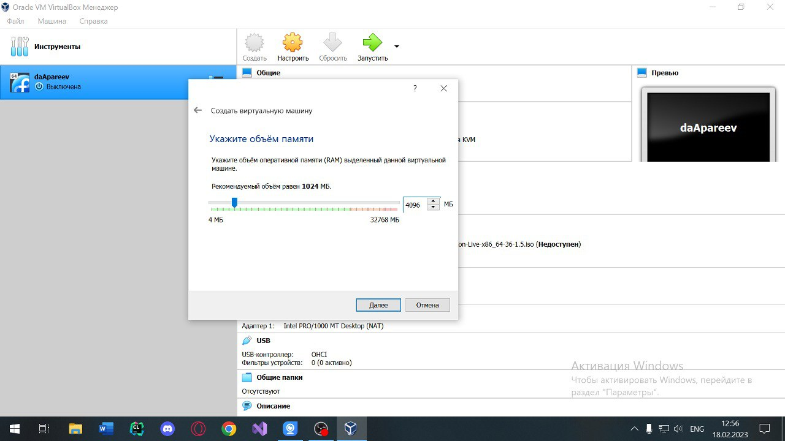
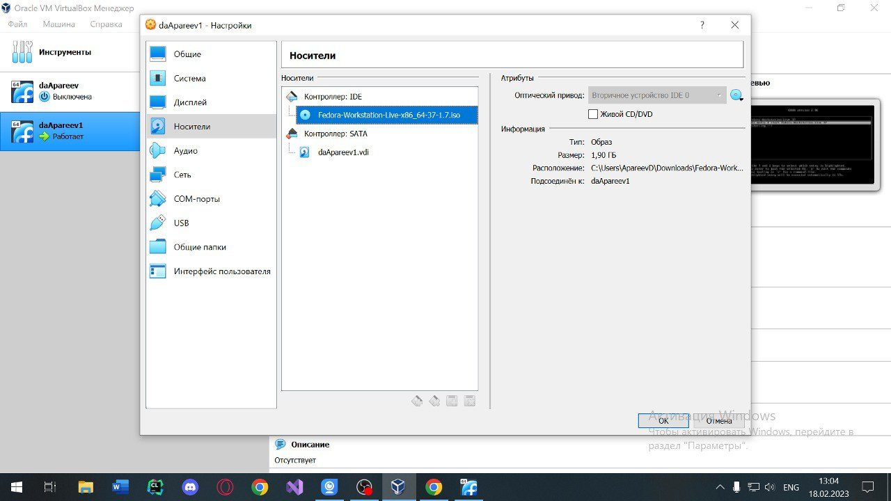
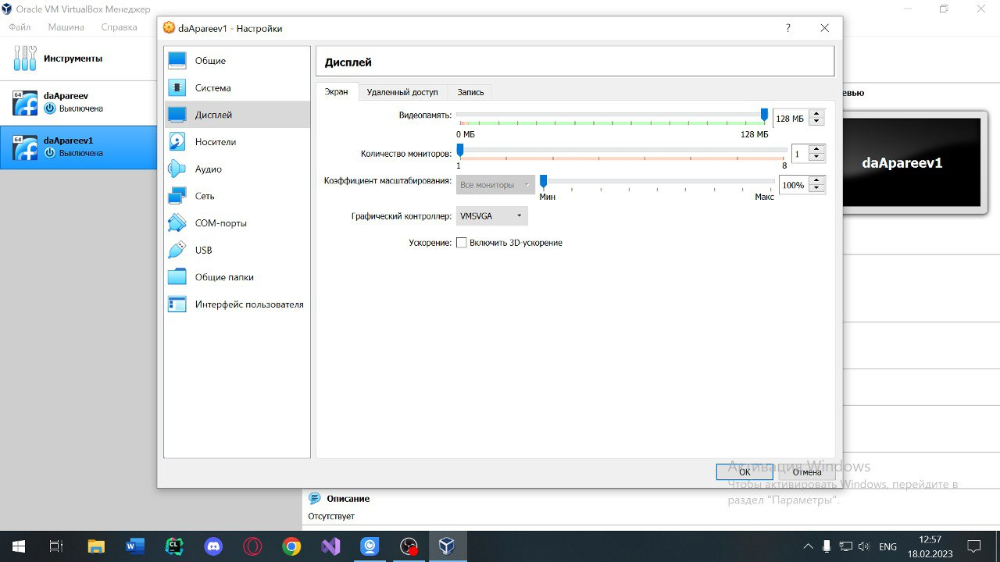

---
## Front matter
title: "Отчёт по лабораторной работе 1"
subtitle: "Операционные системы"
author: "Апареев Дмитрий Андреевич"

## Generic otions
lang: ru-RU
toc-title: "Содержание"

## Bibliography
bibliography: bib/cite.bib
csl: pandoc/csl/gost-r-7-0-5-2008-numeric.csl

## Pdf output format
toc: true # Table of contents
toc-depth: 2
lof: true # List of figures
lot: true # List of tables
fontsize: 12pt
linestretch: 1.5
papersize: a4
documentclass: scrreprt
## I18n polyglossia
polyglossia-lang:
  name: russian
  options:
	- spelling=modern
	- babelshorthands=true
polyglossia-otherlangs:
  name: english
## I18n babel
babel-lang: russian
babel-otherlangs: english
## Fonts
mainfont: PT Serif
romanfont: PT Serif
sansfont: PT Sans
monofont: PT Mono
mainfontoptions: Ligatures=TeX
romanfontoptions: Ligatures=TeX
sansfontoptions: Ligatures=TeX,Scale=MatchLowercase
monofontoptions: Scale=MatchLowercase,Scale=0.9
## Biblatex
biblatex: true
biblio-style: "gost-numeric"
biblatexoptions:
  - parentracker=true
  - backend=biber
  - hyperref=auto
  - language=auto
  - autolang=other*
  - citestyle=gost-numeric
## Pandoc-crossref LaTeX customization
figureTitle: "Рис."
tableTitle: "Таблица"
listingTitle: "Листинг"
lofTitle: "Список иллюстраций"
lotTitle: "Список таблиц"
lolTitle: "Листинги"
## Misc options
indent: true
header-includes:
  - \usepackage{indentfirst}
  - \usepackage{float} # keep figures where there are in the text
  - \floatplacement{figure}{H} # keep figures where there are in the text
---

# Цель работы

Целью данной работы является приобретение практических навыков установки операционной системы на виртуальную машину, настройки минимально необходимых для дальнейшей работы сервисов.

# Задание

Лабораторная работа Установка ОС Linux.

# Выполнение лабораторной работы

Я установил виртуал бокс, затем начал устанавливать виртуальную машину. В качестве системы я выбрал Linux fedora. (рис. @fig:001).

{#fig:001 width=70%}

Далее указал сколько памяти озу необходимо, выбрал 4 гб (рис. @fig:002).

{#fig:002 width=70%}

После чего установил iso образ системы и выделил 80 гб памяти из ssd. (рис. @fig:003). 

{#fig:002 width=70%}

Указал количество видеоматяи (128 мб) (рис. @fig:004). 

{#fig:004 width=70%}

После этих действий пошла установка системы, базовая настройка.

Далее я перехожу в суперпользователя и обновляю все данные (рис. @fig:005). 

{#fig:005 width=70%}

Устанавливаю pandoc (рис. @fig:006). 

{#fig:006 width=70%}

Устанавливаю дополнительные версии pandoc (рис. @fig:007).

{#fig:007 width=70%}

Устанавливаю texlive (рис. @fig:008).

{#fig:008 width=70%}

# Домашнее задание

Версия ядра Linux (Linux version). Частота процессора (Detected Mhz processor). Модель процессора (CPU0). Объём доступной оперативной памяти (Memory available). (рис. @fig:009). (рис. @fig:010).

{#fig:009 width=70%}

{#fig:010 width=70%}

Memory (рис. @fig:0011).

{#fig:011 width=70%}

Тип обнаруженного гипервизора (Hypervisor detected). Mount (рис. @fig:012).

{#fig:012 width=70%}

# Выводы

Выполнив лабораторную работу, я научился устанавливать виртуальную машину с системой Linux.
