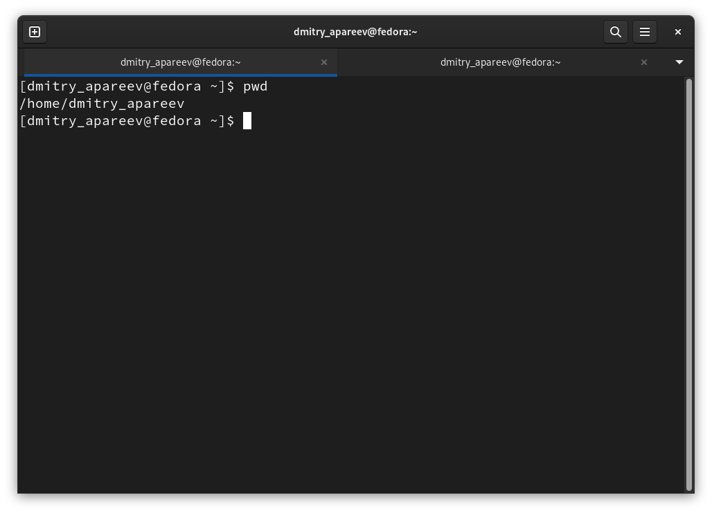
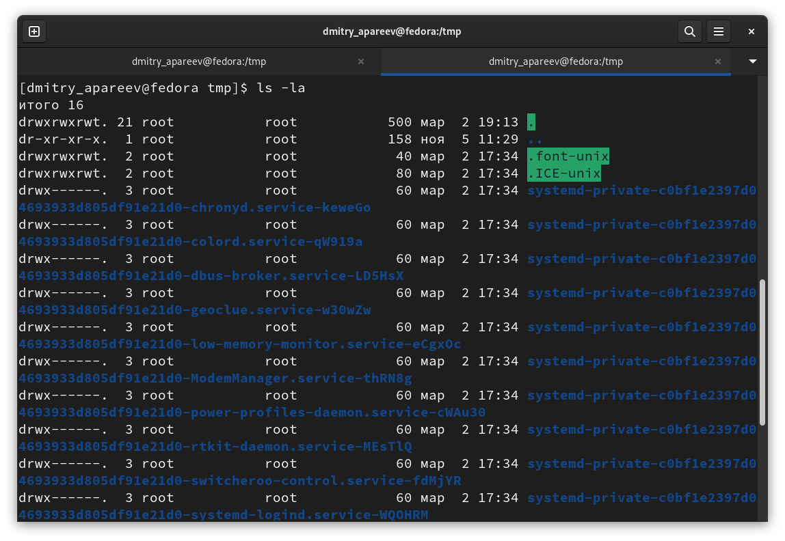
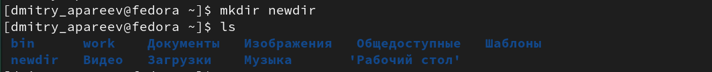
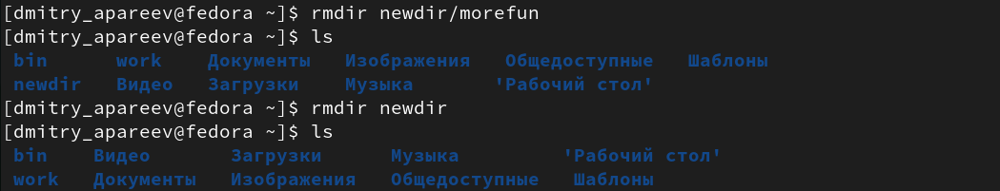
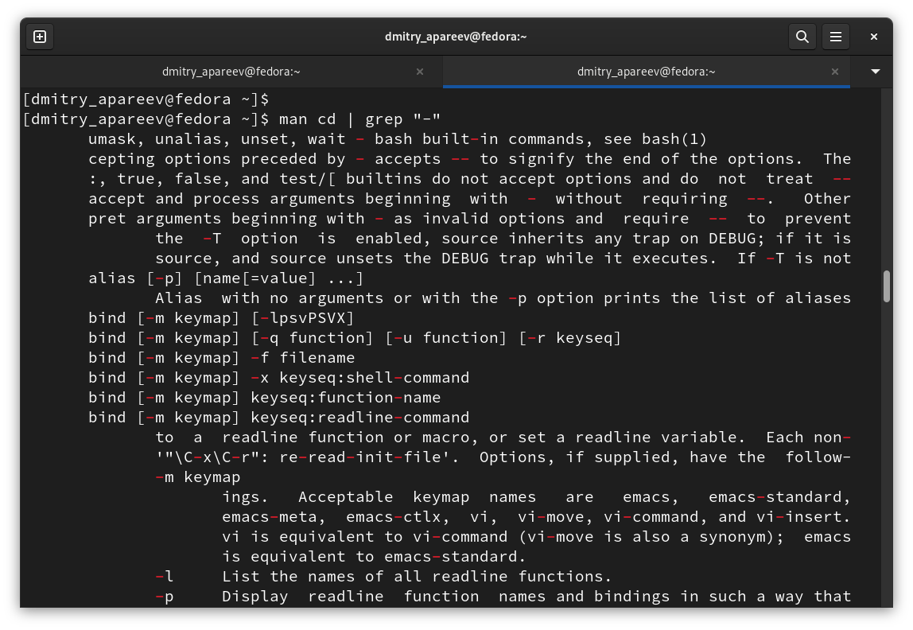
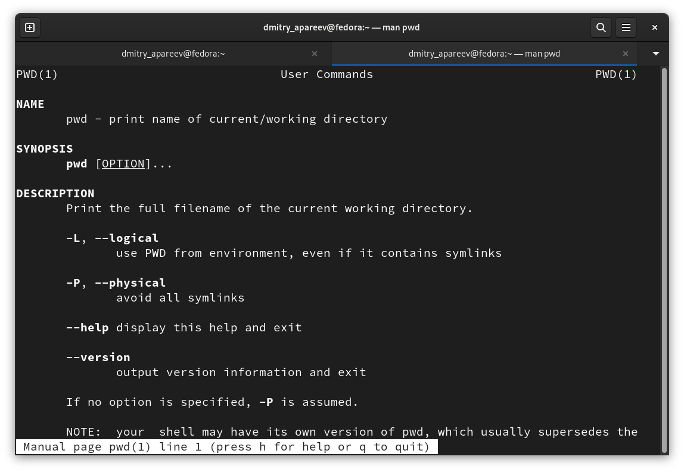
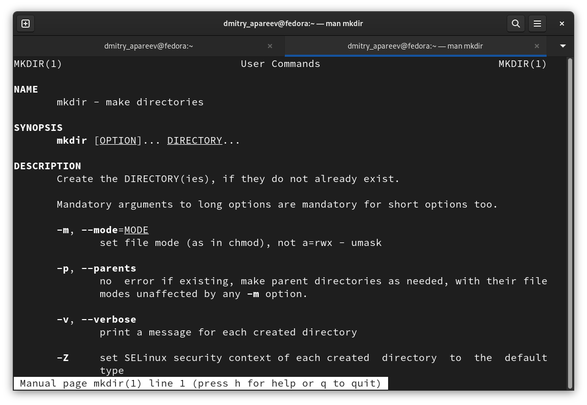
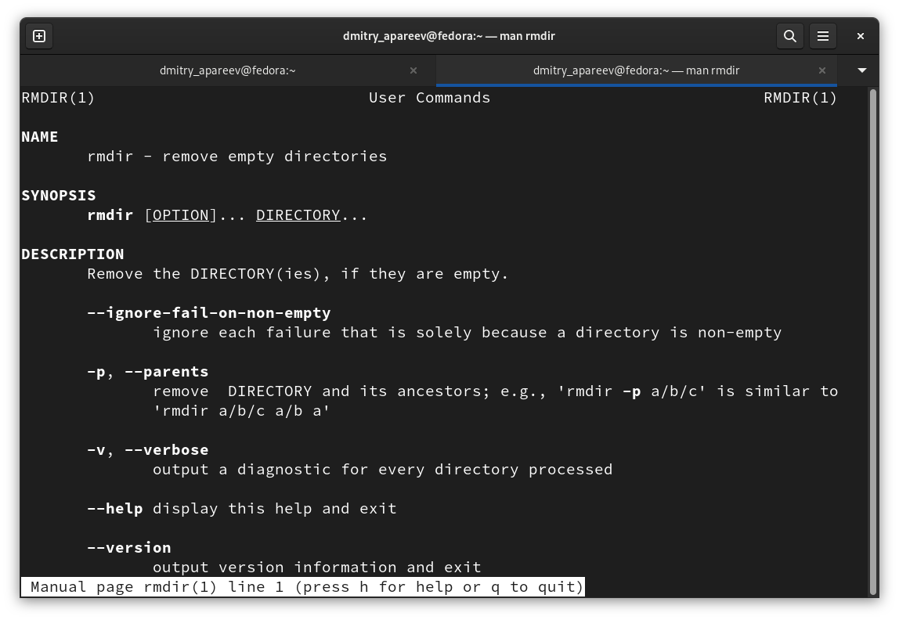
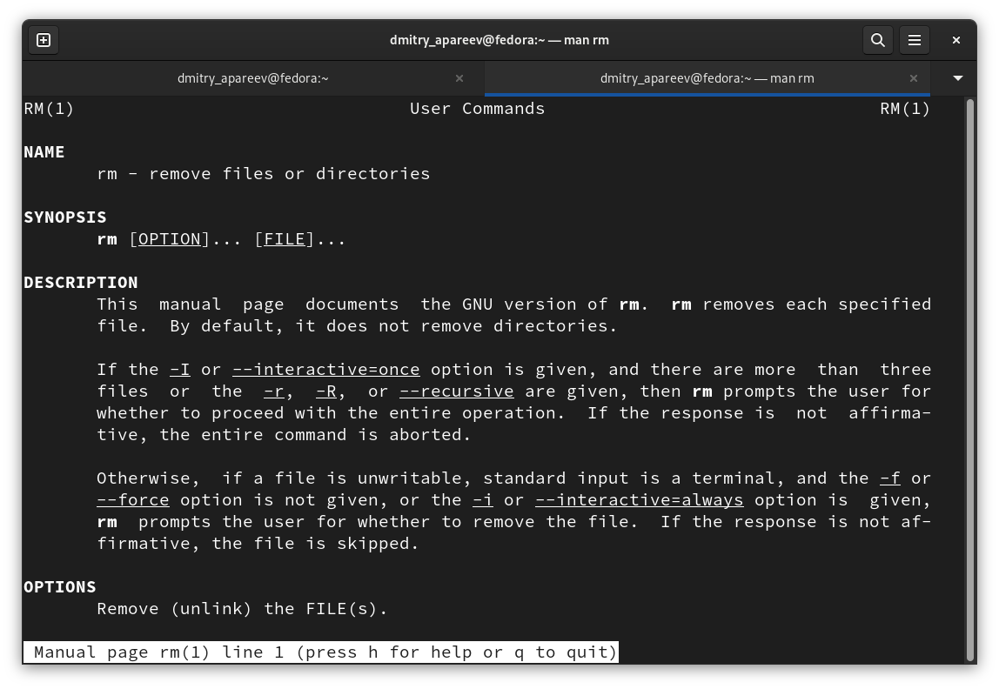
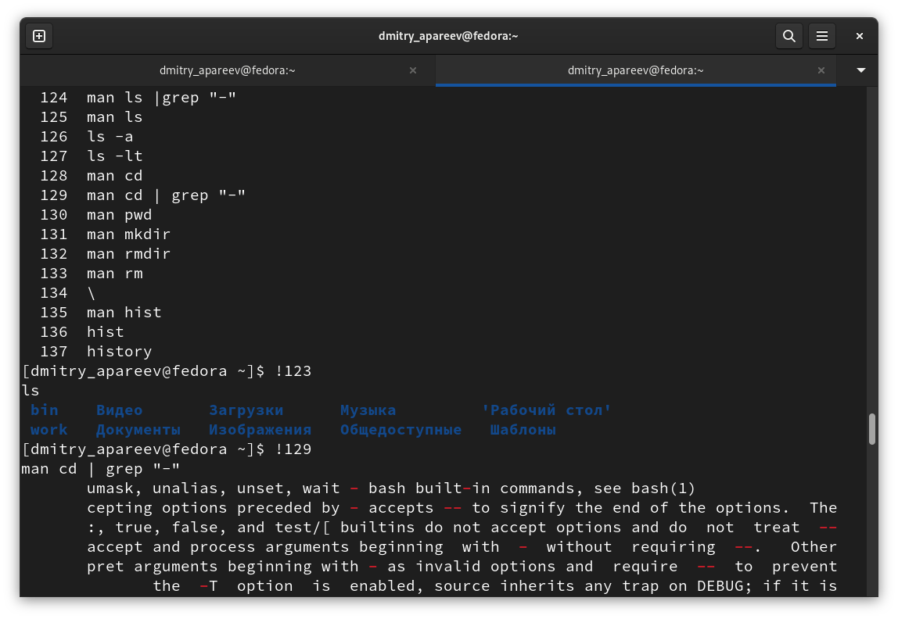

---
## Front matter
lang: ru-RU
title: Основы интерфейса взаимодействия пользователя с системой Unix на уровне командной строки
author:
  - Апареев Д.А.
institute:
  - Российский университет дружбы народов, Москва, Россия
date: 02 марта 2023

## i18n babel
babel-lang: russian
babel-otherlangs: english

## Formatting pdf
toc: false
toc-title: Содержание
slide_level: 2
aspectratio: 169
section-titles: true
theme: metropolis
header-includes:
 - \metroset{progressbar=frametitle,sectionpage=progressbar,numbering=fraction}
 - '\makeatletter'
 - '\beamer@ignorenonframefalse'
 - '\makeatother'
---

# Информация

## Докладчик

:::::::::::::: {.columns align=center}
::: {.column width="70%"}

  * Апареев Дмитрий Андреевич
  * студент бакалавриата 
  * НКАбд-01-22
  * Российский университет дружбы народов

:::
::: {.column width="30%"}

:::
::::::::::::::

# Вводная часть

## Цели и задачи

- Изучить командные строки системы unix в теории и на практике.

## Определяю имя домашнего каталога (рис. @fig:001).

{#fig:001 width=70%}

## Вывожу на экран содержимое каталога /tmp c помощью ls -la(рис. @fig:002).

{#fig:002 width=70%}

## В домашнем каталоге создаю новый каталог с именем newdir. (рис. @fig:003).

{#fig:003 width=70%}

## Удалил каталог ~/newdir/morefun из домашнего каталога. (рис. @fig:004).

{#fig:004 width=70%}

## cd - делает переход в нужный каталог (рис. @fig:005).

{#fig:005 width=70%}

## pwd - выводит название рабочего каталога (рис. @fig:006).

{#fig:006 width=70%}

## mkdir - создает новый каталог (рис. @fig:007).

{#fig:007 width=70%}

## rmdir - удаляет выбранный пустой каталог(рис. @fig:008).

{#fig:008 width=70%}

## rm - удаляет выбранный файл (рис. @fig:009).

{#fig:009 width=70%}

## history
 
### Используя информацию, полученную при помощи команды history, выполнил мо-
дификацию и исполнение нескольких команд из буфера команд (рис. @fig:010).

{#fig:010 width=70%}

# Выводы

Выполнив лабораторную работу, я смог на практике изучить основные командные строки Linux

