---
## Front matter
title: "Отчёт по проекту 1"
subtitle: "Проект"
author: "Дмитрий Андреевич Апареев"

## Generic otions
lang: ru-RU
toc-title: "Содержание"

## Bibliography
bibliography: bib/cite.bib
csl: pandoc/csl/gost-r-7-0-5-2008-numeric.csl

## Pdf output format
toc: true # Table of contents
toc-depth: 2
lof: true # List of figures
lot: true # List of tables
fontsize: 12pt
linestretch: 1.5
papersize: a4
documentclass: scrreprt
## I18n polyglossia
polyglossia-lang:
  name: russian
  options:
	- spelling=modern
	- babelshorthands=true
polyglossia-otherlangs:
  name: english
## I18n babel
babel-lang: russian
babel-otherlangs: english
## Fonts
mainfont: PT Serif
romanfont: PT Serif
sansfont: PT Sans
monofont: PT Mono
mainfontoptions: Ligatures=TeX
romanfontoptions: Ligatures=TeX
sansfontoptions: Ligatures=TeX,Scale=MatchLowercase
monofontoptions: Scale=MatchLowercase,Scale=0.9
## Biblatex
biblatex: true
biblio-style: "gost-numeric"
biblatexoptions:
  - parentracker=true
  - backend=biber
  - hyperref=auto
  - language=auto
  - autolang=other*
  - citestyle=gost-numeric
## Pandoc-crossref LaTeX customization
figureTitle: "Рис."
tableTitle: "Таблица"
listingTitle: "Листинг"
lofTitle: "Список иллюстраций"
lotTitle: "Список таблиц"
lolTitle: "Листинги"
## Misc options
indent: true
header-includes:
  - \usepackage{indentfirst}
  - \usepackage{float} # keep figures where there are in the text
  - \floatplacement{figure}{H} # keep figures where there are in the text
---

# Цель работы

Создать личный сайт на github

# Задание

Создать сайт

# Теоретическое введение

Размещение на Github pages заготовки для персонального сайта.

    Установить необходимое программное обеспечение.
    Скачать шаблон темы сайта.
    Разместить его на хостинге git.
    Установить параметр для URLs сайта.
    Разместить заготовку сайта на Github pages.

# Выполнение лабораторной работы

Сначала я скачал hugo и распаковал его, далее создал папку bin и перенес файл туда (рис. @fig:001).

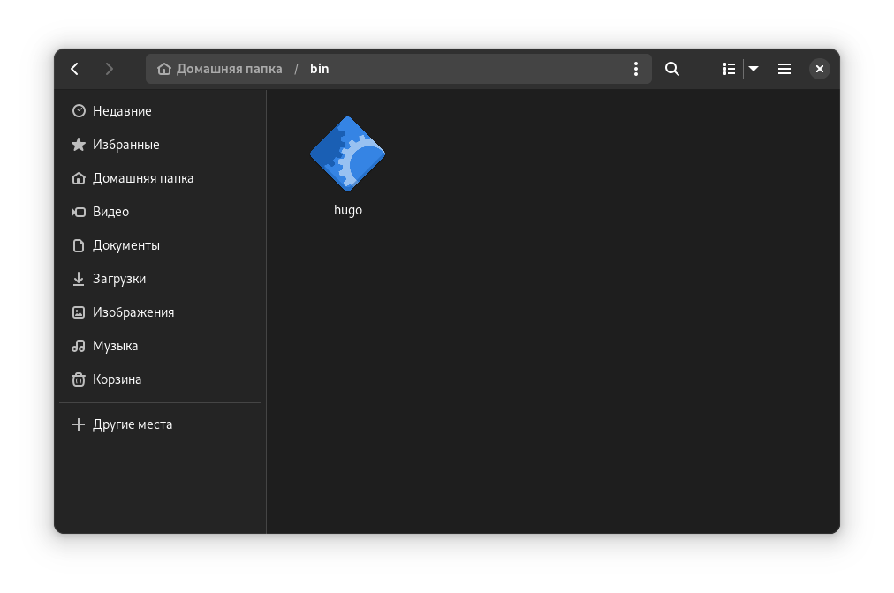{#fig:001 width=70%}

Создаю репозиторий на гитхабе с названием blog (рис. @fig:002).

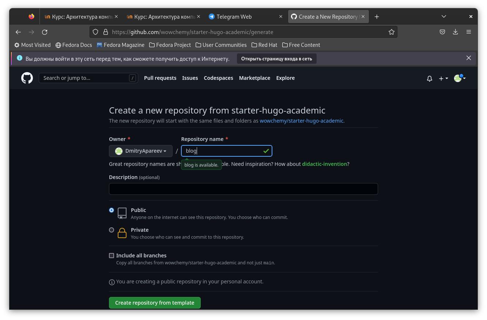{#fig:002 width=70%}

Клонирую репозиторий в блог (рис. @fig:003).

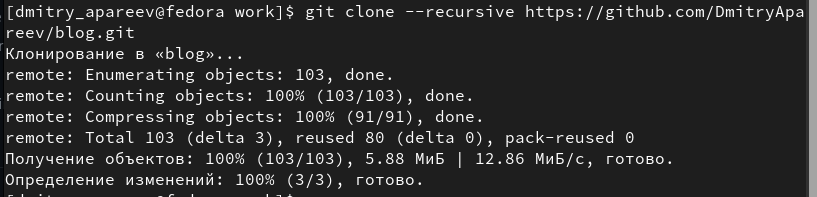{#fig:003 width=70%}

Перехожу в блог и проверяю наличие файлов (рис. @fig:004).

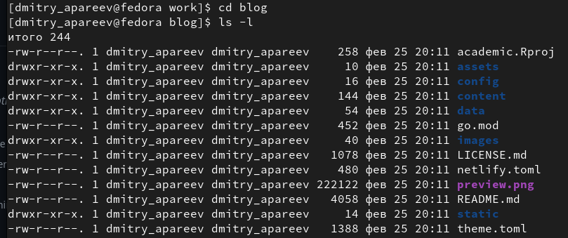{#fig:004 width=70%}

Запускаю исполняемый файл (рис. @fig:005).

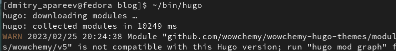{#fig:005 width=70%}

Запускаю исполняемый файла с дополнением server (рис. @fig:006).

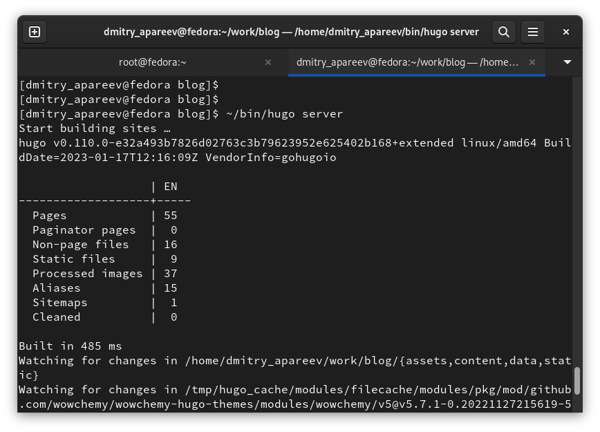{#fig:006 width=70%}

Перехожу по ссылке на сайт (рис. @fig:007).

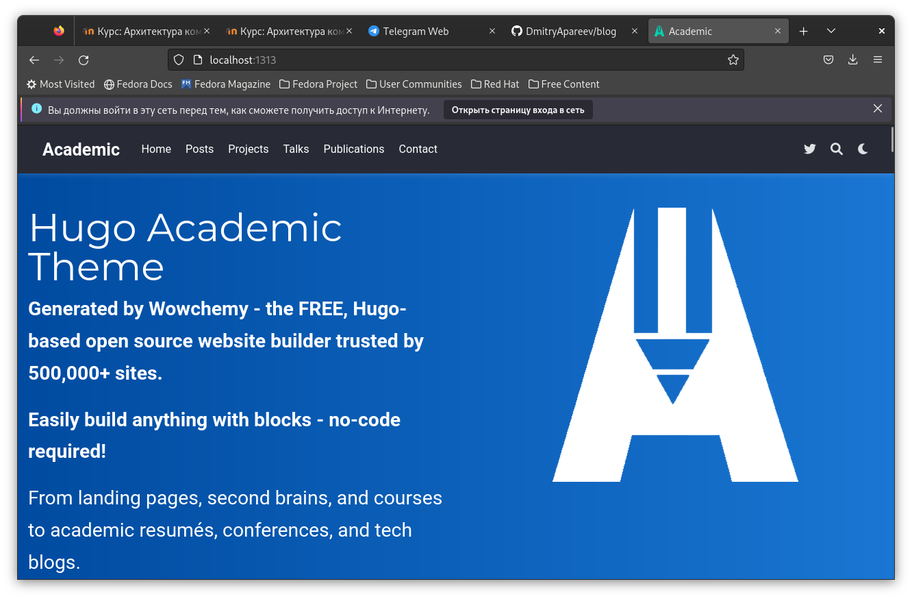{#fig:007 width=70%}

Создаю репозиторий для сайта (рис. @fig:008).

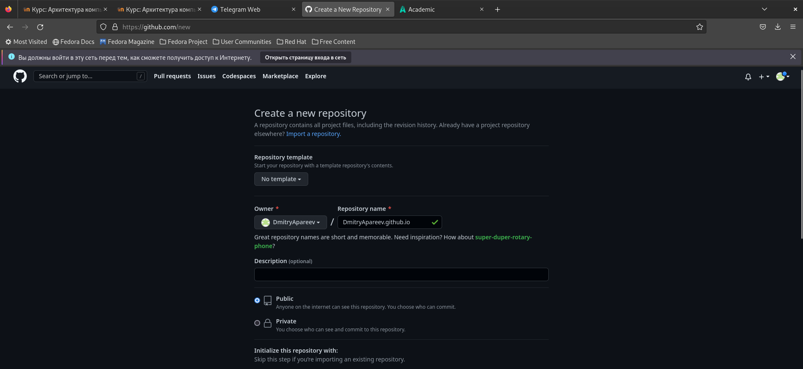{#fig:008 width=70%}

Клонирую репозиторий и перехожу на главную ветку (рис. @fig:009).

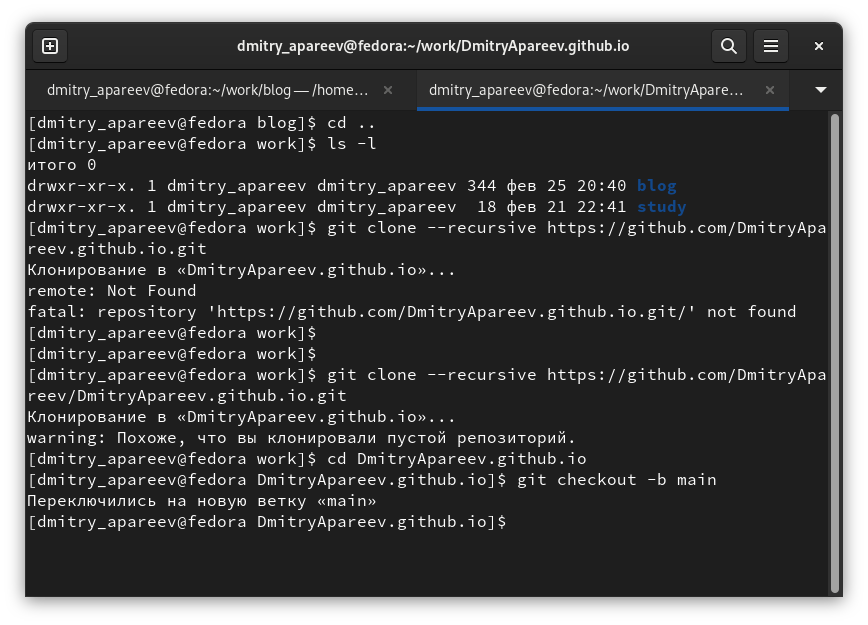{#fig:009 width=70%}

Создаю файл README и коммичу его (рис. @fig:010).

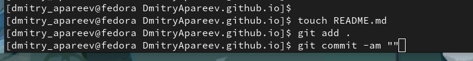{#fig:010 width=70%}

Комментирую строку паблик (рис. @fig:011).

{#fig:011 width=70%}

Подключаю репозиторий к каталогу паблик (рис. @fig:012).

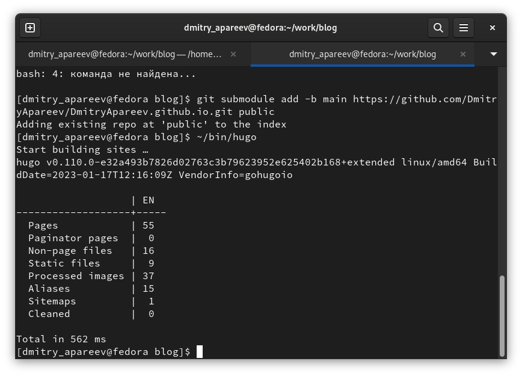{#fig:012 width=70%}

Отправляю все на гитхаб (рис. @fig:013).

{#fig:013 width=70%}

# Выводы

Выполнив часть проектной работы, я смог создать свой личный сайт на платформе гитхаб
